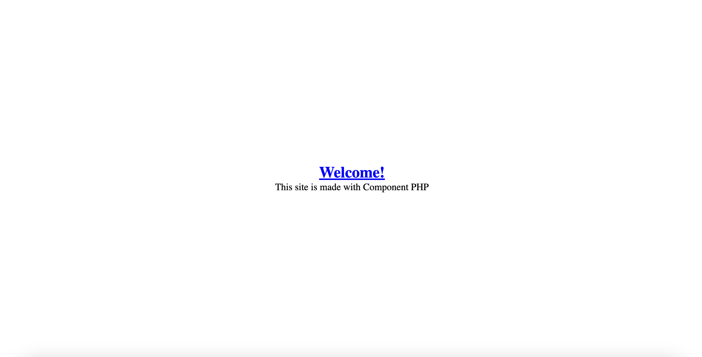
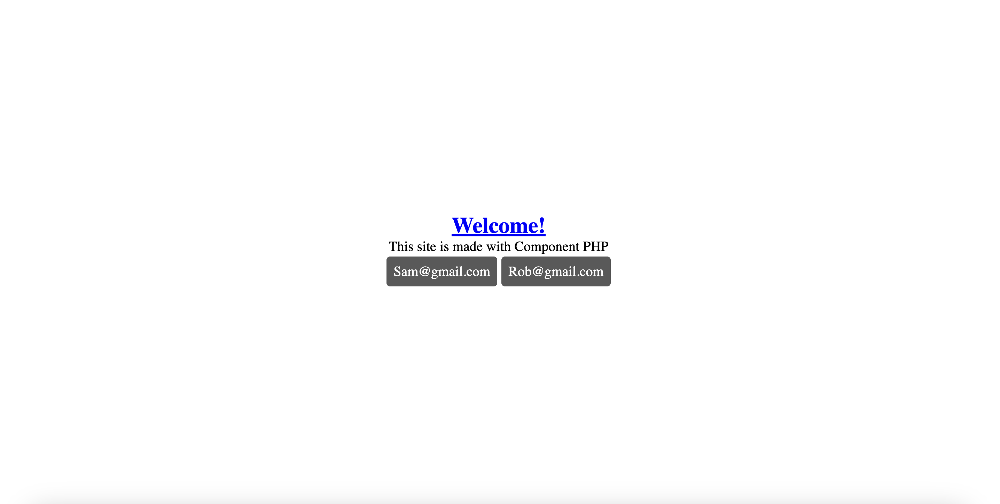

# Component PHP v1.0

Component PHP designed by [@78Sam](https://github.com/78Sam/). View the official site [here](https://sam-mccormack.co.uk/phpsite).

## Create a view

Using the provided generator, create a view based on the schematic provided in components/schematics/view.txt with the following command.

```cmd
python3 generate.py view home
```

This will create a view called home within the /views/ folder. Views are the pages that users will see when navigating through your site.

Note that schematics can be altered to fit your needs. New schematics can be added to the schematics folder and to the generate.py file as well.

>home
```php
<?php

    require_once($_SERVER["DOCUMENT_ROOT"] . "/dir.php");
    require_once($REQUIRE_COMPONENTS);
    require_once($REQUIRE_DATABASE);

?>
<!DOCTYPE html>
<html lang="en">
    <head>
        <meta charset="UTF-8">
        <meta name="viewport" content="width=device-width, initial-scale=1.0">

        <title>home</title>
        <link rel="icon" type="image/x-icon" href="assets/pingu.png">

        <link rel="stylesheet" href="styles/main.css">

        <script src="https://kit.fontawesome.com/8fd25e8e0f.js" crossorigin="anonymous"></script>
        <script src="https://ajax.googleapis.com/ajax/libs/jquery/3.5.1/jquery.min.js"></script>

    </head>
    <body>
        
        <?php
        
            
        
        ?>

    </body>
</html>
```

## Register a route

In order to allow users access to these views, we need to register routes users can take. In the file index.php we have a class called RouteManager, this allows us to register aliases for these views by which users can search for them.

Lets register the newly created home view.

>index.php
```php
<?php

// Suppress error reporting

error_reporting(0);

// Requirements

require_once($_SERVER["DOCUMENT_ROOT"] . "/dir.php");
require_once($REQUIRE_ROUTES);

// Route Manager

$route_manager = new Route();

// Register Routes

$route_manager->registerRoute(
    aliases: ["", "index", "home"],
    route: "home.php"
);

// Resolve Routes

$route = $route_manager->resolveRoute($_SERVER["REQUEST_URI"]);

if ($route !== null) {

    if (isset($route["auth"]) && $route["auth"]) {
        if (!checkAuth()) {
            header("Location: " . $URL_HOME . $route["fallback"]);
            exit();
        }
    }

    require_once($route["path"]);

} else {
    echo "<h1>Error</h1>";
}

?>
```

Now that we have registered the route with route manager, anytime a user attempts to query "", "index", or "home" on your site (the aliases), it will provide the route "home.php" (route).

**Make sure not to name any aliases in such a way that they could be interpreted as an actual path within the file structure, for example 'test' could be interpreted by the browser as a request for access to the folder '/test' which would be hit with a 403.**

## Components

Components are a key feature of page management, they allow custom blocks of HTML and CSS to be added to your page, and hydrated at runtime.

Lets create a component for our homepage

```
python3 generate.py component welcome
```

This generated two files under components/component-welcome/ for us, namely:

>welcome.html
```html
<div class="component-welcome {additional-classes}" {custom-id} {custom-style}>
    <!-- value -->
</div>
```

and

>welcome.css
```css
.component-welcome {

}
```

Here we can see some key features of components:

### Attributes

Attributes are defined via braces, for example {custom-id}, attributes can be replaced with meaningful values when we call the component, for example:

```php
component(
    name: "welcome",
    attributes: ["custom-id"=>"homepage-welcome"]
);
```

at runtime would generate:

```html
<div class="component-welcome" id="homepage-welcome">
    <!-- value -->
</div>
```

The other noteable attributes are: 'additional-classes', 'custom-style' and for forms: 'method', and 'action'.

### Values

Values are how you inject data into your components. Values are identified via HTML comments, for example: '<\!-- value -->'. Much like attributes, as many values as you like can be added to components, and filled out at runtime.

For example:

```php
component(
    name: "welcome",
    values: ["value"=>"<p>Welcome to my website!</p>"]
    attributes: ["custom-id"=>"homepage-welcome"]
);
```

at runtime would generate:

```html
<div class="component-welcome" id="homepage-welcome">
    <p>Welcome to my website!</p>
</div>
```

### How they are displayed

Components can be display a few different ways. Anytime you call the ``` component(); ``` function, whatever is generated will be displayed on the page. Say you wanted to pass a component, or group of components to a component, you could first define it with ``` $comp_1 = _component(); ``` and then pass that variable as a value. If you wanted to pass a group of components as a value, you could use the grouping function as follows: ``` $component_group = group([_component(), _component()]); ```. **Just remember to add the underscore to prevent it being displayed immediately!**

## Spice up the home page

Lets use what we know so far to spice up our landing page.

>welcome.html
```html
<div class="component-welcome {additional-classes}" {custom-id} {custom-style}>
    <h1>
        <!-- title -->
    </h1>
    <p>
        <!-- paragraph -->
    </p>
</div>
```

>welcome.css
```css
.component-welcome {
    width: 100%;
    height: 100vh;
    display: flex;
    flex-direction: column;
}

.component-welcome h1 {
    color: blue;
    text-decoration: underline;
}

.component-welcome p {
    font-size: 20px;
}
```

>home.php
```php
<?php

    require_once($_SERVER["DOCUMENT_ROOT"] . "/dir.php");
    require_once($REQUIRE_COMPONENTS);
    require_once($REQUIRE_DATABASE);

?>
<!DOCTYPE html>
<html lang="en">
    <head>
        <meta charset="UTF-8">
        <meta name="viewport" content="width=device-width, initial-scale=1.0">

        <title>home</title>
        <link rel="icon" type="image/x-icon" href="assets/pingu.png">

        <link rel="stylesheet" href="styles/main.css">

        <script src="https://kit.fontawesome.com/8fd25e8e0f.js" crossorigin="anonymous"></script>
        <script src="https://ajax.googleapis.com/ajax/libs/jquery/3.5.1/jquery.min.js"></script>

    </head>
    <body>
        
        <?php
        
            component(
                name: "welcome",
                attributes: ["custom-style"=>"justify-content:center; align-items:center;"],
                values: [
                    "title"=>"Welcome!",
                    "paragraph"=>"This site is made with Component PHP"
                ]
            );
        
        ?>

    </body>
</html>
```

To view your work, just run the `start_server.py` file, and navigate to one of your registered aliases, for example: `localhost:8000/home`, which should appear as:



## Databases

Databases can be linked via the example.env file located at `components/example.env`. If you wish to run a remote database the required credentials must be filled out in the example.env file **and then saved as .env**.

If you wish to run a local DB such as SQLITE, you can place the database inside the `components/data` folder, and add the database filename to the .env file.

From there you will be able to instantiate a database class in any view, and perform queries on it. For example, much like values and attributes in components, you can create .sql query files with values that can be hydrated at runtime. However in this simple example I will have one database, and a simple SQL query.

I have also added an extra component, as well as modify existing ones.

>welcome.html
```html
<div class="component-welcome {additional-classes}" {custom-id} {custom-style}>
    <h1>
        <!-- title -->
    </h1>
    <p>
        <!-- paragraph -->
    </p>
    <div class="flex">
        <!-- users -->
    </div>
</div>
```

>welcome.css
```css
.component-welcome {
    width: 100%;
    height: 100vh;
    display: flex;
    flex-direction: column;
}

.component-welcome h1 {
    color: blue;
    text-decoration: underline;
}

.component-welcome p {
    font-size: 20px;
}
```

>user.html
```html
<div class="component-user {additional-classes}" {custom-id} {custom-style}>
    <p>
        <!-- email -->
    </p>
</div>
```

>user.css
```css
.component-user {
    padding: 10px;
    margin: 3px;
    background-color: rgb(89, 89, 89);
    border-radius: 5px;
}

.component-user p {
    color: white;
}
```

I have also updated the `styles/main.css` file to add a flex class used in `components/component-welcome/welcome.html`

>main.css
```css
.flex {
    display: flex;
}
```

The SQL query (stored in `components/data`) I will use is as follows:

>getUser.sql
```sql
SELECT `email` from `UserAccounts`;
```

Finally, the updated home view, note that I am now also using the `_component()` and `group()` functions to create components ahead of time, group them together, and pass them to a single value.

>home.php
```php
<?php

    require_once($_SERVER["DOCUMENT_ROOT"] . "/dir.php");
    require_once($REQUIRE_COMPONENTS);
    require_once($REQUIRE_DATABASE);

?>
<!DOCTYPE html>
<html lang="en">
    <head>
        <meta charset="UTF-8">
        <meta name="viewport" content="width=device-width, initial-scale=1.0">

        <title>home</title>
        <link rel="icon" type="image/x-icon" href="assets/pingu.png">

        <link rel="stylesheet" href="styles/main.css">

        <script src="https://kit.fontawesome.com/8fd25e8e0f.js" crossorigin="anonymous"></script>
        <script src="https://ajax.googleapis.com/ajax/libs/jquery/3.5.1/jquery.min.js"></script>

    </head>
    <body>
        
        <?php
            
            $db = new Database();

            $users = [];
            foreach ($db->query(query: "getUser") as $row) {
                $users[] = _component(
                    name: "user",
                    values: ["email"=>$row["email"]]
                );
            }

            component(
                name: "welcome",
                attributes: ["custom-style"=>"justify-content:center; align-items:center;"],
                values: [
                    "title"=>"Welcome!",
                    "paragraph"=>"This site is made with Component PHP",
                    "users"=>group($users)
                ]
            );
        
        ?>

    </body>
</html>
```

Which should result in this:



## TODO

- Ability to create custom attributes
- Documentation
- LOTS of testing